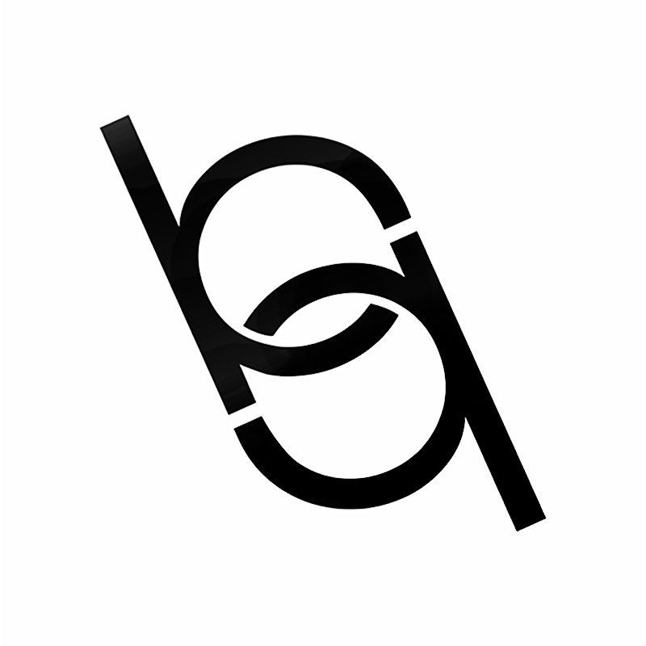

# Portifolio Bernardo
<p align="center">
    
</p>


<h2>Tópicos 📋</h2>

   <p>

   - [📖 Sobre](#-sobre)
   - [📱 Preview](#-preview)
   - [📦 Assets](#-assets)
   - [🛠️ Funcionalidades e Tecnologias Estudadas](#%EF%B8%8F-funcionalidades-e-tecnologias-estudadas)
   - [🤔 Como usar](#-como-usar)
   - [📝 Licença](#-licença)

   </p>
   
   <h2>📖 Sobre</h2>

<p>
  Projeto de Portifólio pessoal desenvolvido em Flutter/Dart visando aprimorar conhecimentos de front-end, utilização de package e consumo de arquivo em Json.
</p>

---


<h2>📱 Preview</h2>

   <p align="center">
      
   </p>

---

<h2>📦 Assets</h2>


- Pasta <a href="https://github.com/bhqn/portifolio-bernardo/tree/FixForBug/model/images">**`/assets`**</a>
- JSON  <a href="https://github.com/bhqn/portifolio-bernardo/tree/FixForBug/lib/pages/designpage>`** `/json`**</a>


---   

<h2>🛠️ Funcionalidades e Tecnologias Estudadas</h2>
    
 - Packages Utilizados
    - cupertino_icons: ^1.0.2 
    - url_launcher: ^6.0.20
    - http: ^0.13.4
    - syncfusion_flutter_charts: ^20.1.47+1
    - hex: ^0.2.0
    - hexcolor: ^2.0.6
    - font_awesome_flutter: ^10.1.0
    - flutter_spinkit: ^5.1.0
    
    

- Funcionalidades
    - Menu ("Drawer") com Principais links e informações de contato
    - Disponibilizar Links de Projetos antigos
    - Disponibilzar Artes produzidas a partir de um Arquivo JSON em um GridView (ex: Layout do Intagram )
    - utilização do mediaQuery.size para Responsividade do layout
    - Themes
    - Formulário integrado com E-mail do Usuário para contato

- Telas: 
    - Splash (tela inicial do app para transição)
    - Home (tela principal do app e que serve de fluxo inicial para as demais telas descritas abaixo)
    - Sobre (View disponibilizando informações como Dados Pessoais, Cursos e Skills utilizando syncfusion_flutter_charts para construção de Gráficos)
    - Dev (View Disponibilizando links de projetos antigos)
    - Design (View Disponibilizando artes aos moldes do Instagram)
    - Contato (Formulário integrado com Email do usuario para envio de mensagens) 
   </p>

---

<h2>🤔 Como usar</h2>

   ```
   Configure o ambiente de desenvolvimento na sua máquina:
   https://flutter.dev/docs/get-started/install

   - Clone o repositório:
   $ git clone https://github.com/felipecastrosales/app_filmes app_filmes

   - Entre no diretório:
   $ cd app_filmes

   - Instale as dependências:
   $ flutter pub get

   - Execute:
   $ flutter run
   ```

---

<h2>📝 Licença</h2>

<p>
   Esse repositório está sobre a Licença MIT, e você pode vê-la no arquivo <a href="https://github.com/felipecastrosales/app_filmes/blob/master/LICENSE">LICENSE</a> para mais detalhes. 😉
</p>

---

   >Esse projeto foi desenvolvido com ❤️ por **[@Felipe Sales](https://www.linkedin.com/in/felipecastrosales/)**, com o instrutor **[@Rodrigo Rahman](https://br.linkedin.com/in/rodrigo-rahman)**, no evento #DartWeek da **[Academia do Flutter](https://hotmart.com/product/academia-do-flutter/O24924684W)**.<br>
   Se isso te ajudou, dê uma ⭐, e contribua, isso irá me ajudar também 😉

---

   <div align="center">

   [](https://www.linkedin.com/in/felipecastrosales/)

   </div>


